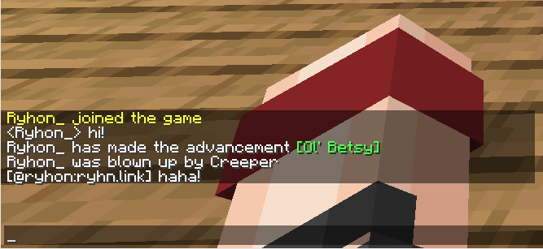

# Minetrix2
A fork of Minetrix with a ton of new features.  
Minetrix is a two-way Minecraft-Matrix bridge utilizing a bot account instead of a puppet service.  

  

Minetrix 2 automatically converts Minecraft formatting codes to Matrix HTML.  
It also supports [ChatItem](https://github.com/dadus33-plugins/ChatItem) (tested on 2.3-2.4). Innuendos not included.  

## Installing
You will need a spigot compatible server, like Bukkit, Paper or Pufferfish.  
Once your server is running, download the plugin from [Releases](https://github.com/ryhn-link/Minetrix/releases/) or build it yourself using `mvn package`, the output file will be `target/minetrix-(version number).jar`.  

## Configuration
Run the server with the plugin isntalled at least once, this will generate a default config file in `plugins/Minetrix/config.yml`.  

### Matrix
Replace the `server` value in the `matrix` field with the address of your homeserver, e.g. `https://matrix.org`.  
Then replace `YOUR_ACCESS_TOKEN` in the config with your access token.  
Finally replace the `room_id` value with your room ID or alias.  

### Message formatting
Messages can be customized by changing their format in the config.  
Minetrix2 supports separate formats for HTML and default message format.  
Fields in `format.html` will be used for HTML formatting, fields in `format.fallback` will be used for default formatting.  
Additionally you can change the `msgtype` of the message to add special effects or disable notifications for less important events.  

A placeholder is a substring consisting of a key and `%` it, it is replaced by a dynamic value, e.g. `%player% said %body%` will turn into `Ryhon said test`.  

#### Matrix -> Minecraft
| Field | Description | Placeholders |
|---|---|---|
| format.matrix | Incoming message from Matrix | `user` - Display name of the sender `username` - Matrix user ID of the sender `body` - contents of the message |

#### Minecraft -> Matrix
The following fields are children of the `format.html` and `format.fallback` fields.  
| Field | Description | Placeholders |
|---|---|---|
| chat | Sent when a minecraft chat message is recieved | `player` -  player's sername `body` - Message body
| join, leave | Sent when a player joins or leaves the server | `player` - player's username
| death | Sent when a player dies | `player` - player's username `deathmsg` - The death message `cause` - Entity name that killed the player
| advancement | Sent when a player gets an advancement | `player` - player's username `advancement` - The advancement title |
| serverStart, serverClose | Sent when the extension is enabled or disabled | -

#### msgtypes
You can change msgtypes per event by changing coresponding field in the `msgtype` field.    
These are the possible `msgtype`s. Some might not be available in all chat clients.    
| msgtype | Description |
|---|---|
| m.text | Standard chat message
| m.notice | Notice message, no notification sent
| m.emote | Puts `*` before the message |
| - | The types below disable HTML rendering
| io.element.effects.space_invaders | Makes 👾 emojis fall
| io.element.effect.snowfall | Makes snow fall
| io.element.effect.rainfall | Makes rain fall
| io.element.effect.hearts | Makes hearts rise
| nic.custom.confetti | Makes confetti fall
| nic.custom.fireworks | Shows fireworks exploding